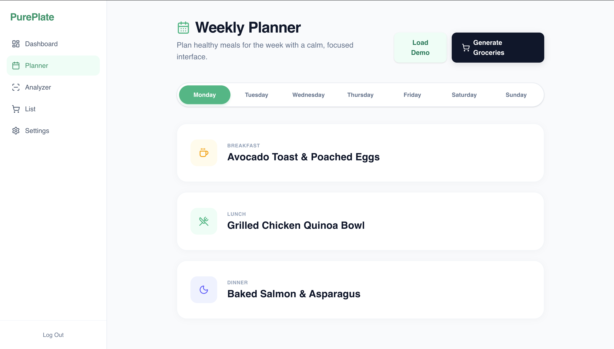
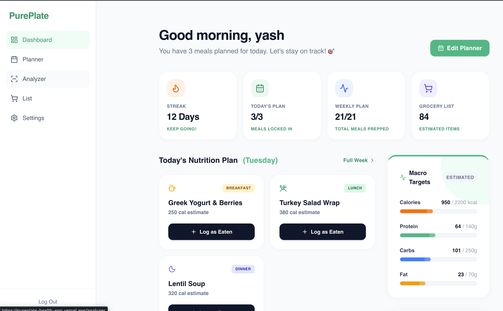
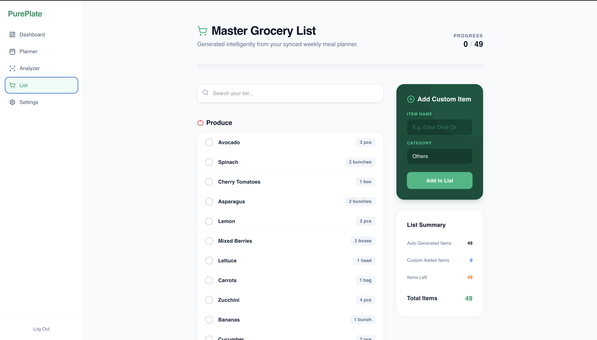
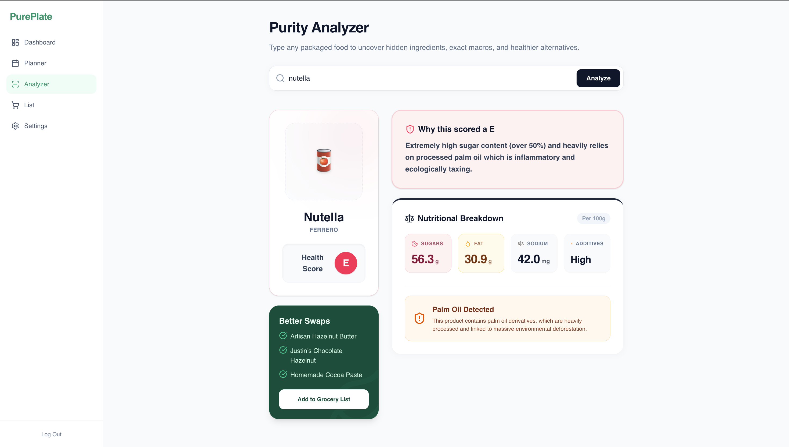

<div align="center">
  
  <h1>PurePlate</h1>
  <p><strong>The intelligent, connected ecosystem for modern nutrition and meal planning.</strong></p>
  <p>
    <a href="#the-connected-workflow">Workflow</a> • 
    <a href="#how-to-evaluate">For Judges</a> • 
    <a href="#technical-decisions">Architecture</a> • 
    <a href="#setup-instructions">Setup</a>
  </p>
</div>

---

## Why PurePlate Exists

Most health applications address isolated problems: one app tracks macros, another stores recipes, and a third builds grocery lists. This fragmented experience leads to app fatigue and abandoned diets. 

**PurePlate exists to bridge the gap.** It is a centralized, highly connected ecosystem where every action directly informs the next. Your weekly meal plan automatically dictates your daily macro dashboard, which in turn auto-generates your exact grocery list. 

## The Connected Workflow

PurePlate is not a collection of isolated features—it is a single, continuous workflow designed to eliminate decision fatigue.

```text
🗓️ Planner ──► 📊 Dashboard ──► 🛒 Grocery List ──► 🔍 Analyzer
```

1. **Planner:** You schedule your meals for the week.
2. **Dashboard:** Reads your planner in real-time, calculates exact daily macros (Calories, Protein, Carbs, Fat) based on today's schedule, and updates your progress towards personalized goals.
3. **Grocery List:** Aggregates your entire week's meal plan and auto-generates the necessary ingredients, saving you hours of manual list-building.
4. **Analyzer:** When you're at the store buying those groceries, you scan or search packaged products to expose hidden additives and make healthier choices.

## Ecosystem Features

Rather than treating features as independent utilities, PurePlate integrates them deeply:

- **State-Aware Dashboard:** It doesn't just show generic data. It looks at *today's date*, cross-references your **Weekly Planner**, maps those meals to our internal nutrition database, and dynamically generates your health metrics.
- **Automated Procurement (Grocery):** No manual data entry needed. If you planned "Avocado Toast" for Wednesday, the ingredients are already on your grocery list.
- **Purity Analyzer:** Evaluates the quality of your ingredients. Before you buy packaged items for your planned meals, the Analyzer decodes the label to flag harmful preservatives or unhealthy macros.
- **Targeted Personalization:** Your settings profile establishes your baseline macro goals, which directly dictate the progress bars powering the Dashboard.

## How Evaluators Should Test It

To understand the power of the connected ecosystem, please follow this guided flow:

1. **Initialize the Planner:** 
   - Navigate to the **Weekly Planner**.
   - Add meals to the current day (e.g., *Oatmeal with Almonds* for Breakfast, *Grilled Chicken Quinoa Bowl* for Lunch).
2. **Watch the Dashboard React:**
   - Switch to the **Dashboard**. 
   - Observe how your daily nutrition analytics and progress bars have automatically calculated based purely on what you just planned.
3. **Check the Auto-Generated List:**
   - Navigate to the **Grocery** section. 
   - See how your weekly plan has instantly populated the pending ingredients list.
4. **Test the Analyzer:**
   - Open the **Product Analyzer**.
   - Search for supported demo products (e.g., `Nutella`, `Maggi`, `Oreo`, `Lay's`) to experience the instant additive flagging and macro breakdown engine.

## Technical Decisions

We engineered PurePlate with a focus on **reliability, speed, and architectural scalability**.

- **Why Local Datasets & Mappings?** 
  Instead of relying on rate-limited, high-latency external APIs for the initial launch, PurePlate uses a curated internal nutrition mapping engine and local dataset. 
  - **Zero Latency:** Dashboard analytics compile instantly without network lag.
  - **Demo Reliability:** Evaluators and judges will never experience a broken demo due to a downed third-party server.
  - **API-Ready Architecture:** The data fetching logic is abstracted into scalable hooks (e.g., `useDashboardData`). Swapping the local JSON mappings for a live REST API (like Edamam) requires changing just one hook, without touching the UI layer.

## Screenshots

*Add screenshots here to visually demonstrate the connected flow.*

| 1. Plan Your Week | 2. Dashboard Calculates Macros |
| :---: | :---: |
|  |  |

| 3. Auto-Generated Groceries | 4. Analyze Products |
| :---: | :---: |
|  |  |

## Why This Project Stands Out

Basic CRUD (Create, Read, Update, Delete) apps treat data as static records. PurePlate treats data as a flowing stream. 

This application stands out because it proves an understanding of **complex state management** and **product design**. It is built the way a startup would build a Minimum Viable Product (MVP): prioritizing a flawless, connected user experience, ensuring rock-solid demo reliability through intelligent data abstraction, and keeping the architecture decoupled for future scaling.

## Future Scope

- **Live Edamam Integration:** Swap the internal mapping hook to fetch infinite meal and recipe data directly from the Edamam API.
- **Native Barcode Scanner:** Allow users to use their device camera to scan barcodes directly into the Product Analyzer.
- **AI-Powered Meal Generation:** Introduce LLMs to automatically build the weekly planner based on a user's strict caloric and macro targets.
